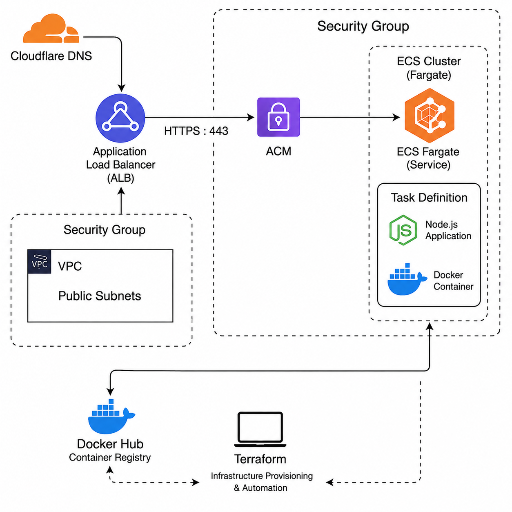
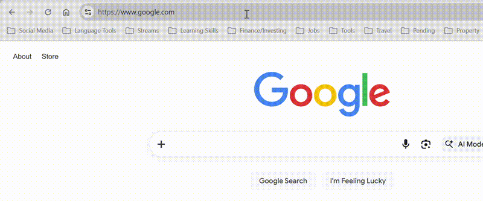
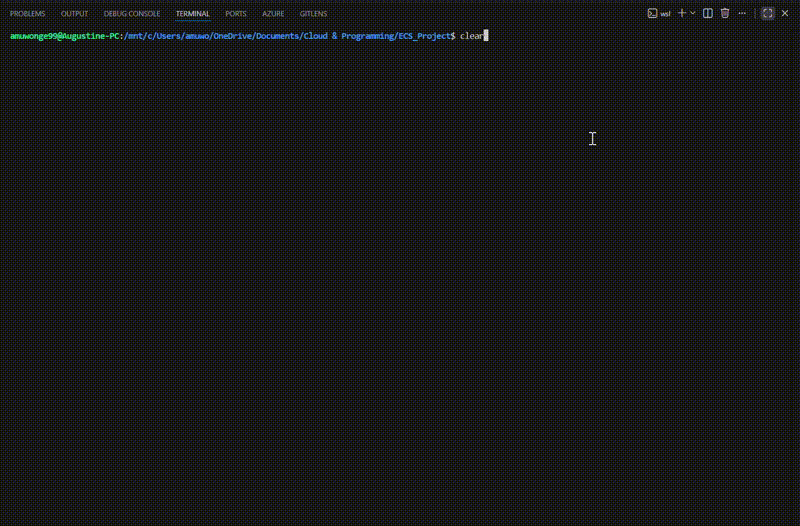
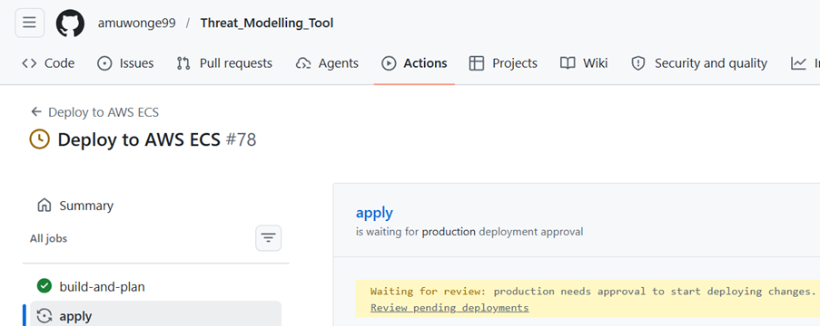
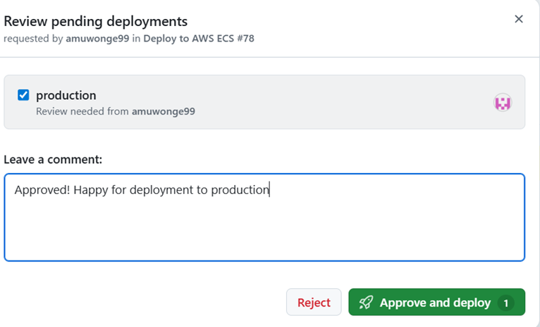
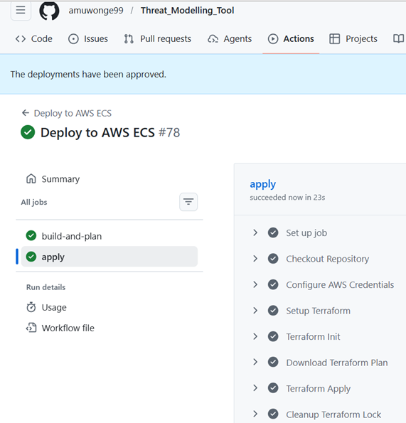
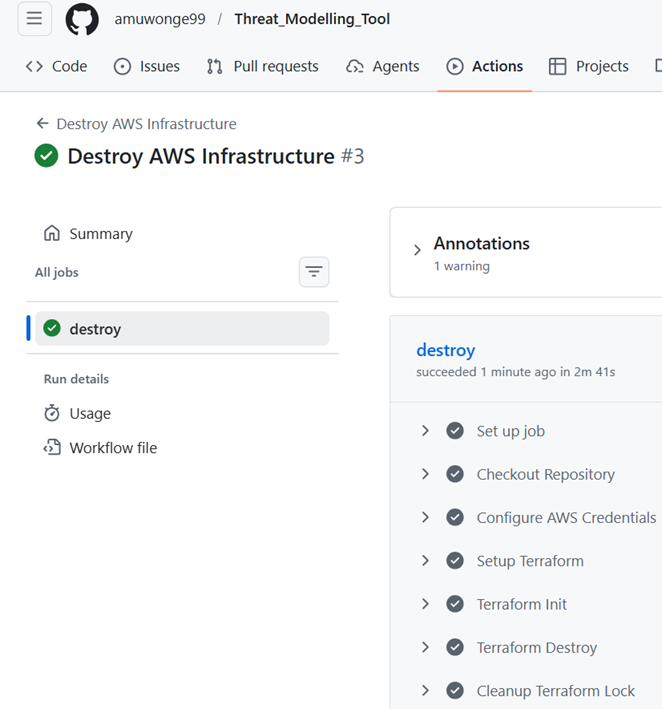

# Overview

This project demonstrates how to deploy a Node.js-based Threat Modelling Tool on AWS using Docker, ECS Fargate, and Terraform. The app is served securely over HTTPS with a custom domain and load-balanced for high availability.

# Tech Stack & Architecture Design

- Node.js Application - Core threat modelling tool
- Docker - Containerised application
- CI/CD - GitHub Actions pipeline for automated builds & destroys
- Amazon ECS Fargate - Serverless container orchestration
- Terraform - Infrastructure provisioning
- Application Load Balancer (ALB) - Traffic routing and availability
- AWS Certificate Manager (ACM) - TLS/SSL certificate management
- Cloudflare DNS - Public DNS and domain management
- Docker Hub - Container image registry
- VPC + Security Groups - Network isolation and security

# Demos & CI/CD Pipeline

## Browser Demo (Domain & Redirect Working)

## Terminal Demo (Status Check)

## Deployment Paused Until Approved

## Manual Approval Gate

## Successful Deployment

## Destroy Pipeline

## Design Choices

- I chose Fargate over EC2 because I wanted a more managed offering that's hands-off
- I chose Docker Hub over ECR because it's cloud agnostic which gives more flexibility
- I chose Terraform over CloudFormation as it's the most used IAC tool for infrastructure provisioning
- I chose Cloudwatch over Prometheus & Grafana because it's native to AWS so it was easier to implement
- I chose an ALB over NLB as I needed routing for HTTP/HTTPS

## Instructions on Deploying Locally

- git clone https://github.com/amuwonge99/Threat_Modelling_Tool.git
- cd ECS_Project
- docker build -t threat-modelling-tool .
- docker run -p 3000:3000 threat-modelling-tool
- Select the link http://localhost:3000

## Prerequisites
- AWS account with CLI configured
- Cloudflare account & registered domain  
- Docker, Terraform (>= 1.5.0) & Node.js ( >= 20) installed 

# Current Limitations & Future Improvements

1. Access key use. Currently using the IAM user "Gus" with access keys. Could be replaced with GitHub Actions OIDC for keyless authentication.

2. Route 53. Currently requires manual CNAME entry in Cloudflare on first deploy and cert renewal. Can be automated with Route 53 after 60 day lock expiry

3. Autoscaling. ECS desired count is hardcoded to 2. ECS Auto Scaling can be added to scale based on CPU/memory alarms

4. No vulnerability scanning e.g. Trivy in pipeline. Can be added as a scan step after the Docker build to catch CVEs in the image before it is pushed to Docker Hub

5. Migration to ECR. Docker Hub works fine, but ECR would integrate better as the project is AWS based.

6. Modularisation. Reusable modules can be used for networking, ECS, and ALB to improve reusability

7. Messy repository. Use of more directories (particularly for screenshots) would improve appearance of the repository.

